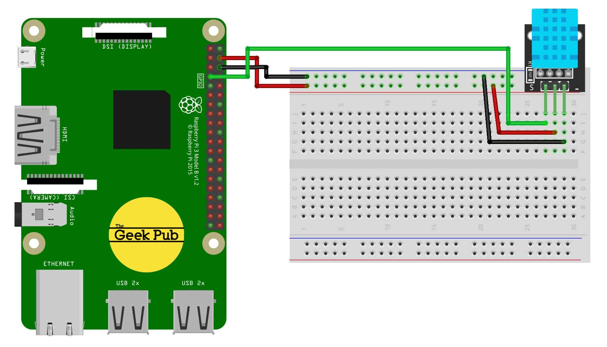

# temperature-backend

Contains source code to build the `temperature-sensor-pi` Debian package, which installs temperature + humidity gathering & Firebase upload services
on the Raspberry Pi.

## Prerequisites

In order to function, it is expected that you have 

* A) configured a DH11 temperature & humidity sensor on your Raspberry Pi
* B) configured a Firebase project

### A) DH11 sensor setup

The DHT11 sensor should be connected to the Raspberry Pi like that:



Source: https://tutorials-raspberrypi.com/raspberry-pi-measure-humidity-temperature-dht11-dht22/

### B) Firebase setup

1) Create a Firebase project according to https://firebase.google.com/docs/web/setup
2) Create a Realtime Database
3) Set the rules to:
```
{
  "rules": {
    "data": {
      ".read": true,
      ".write": "auth !== null"
    }
  }
}
```
4) Modify the `FIREBASE_PROJECT_ID` variable in the `config.py` file where the endpoint to Firebase is configured

## How to install & setup the package

Install directly on your Raspberry Pi via

    make install

or

	./create_deb.sh
	sudo gdebi dist/temperature-sensor-pi_1.0.0_all.deb

Also ensure nodejs & npm is installed:

	sudo apt install nodejs npm

And, install firebase-tools and login there with your Firebase-linked account:

	sudo npm install -g firebase-tools
	sudo firebase-tools login --no-localhost

## How to monitor it

Two services are installed as part of the package installation:

* `temperature-gather.service` -> for gathering of data and appending to csv file, runs every 5 minutes
* `temperature-upload.service` -> for uploading of data to Firebase, runs every 15 minutes (via `temperature-upload.timer`)

Log data is created in `/var/log/temperature/`

## How to debug issues

Run the following commands to get debug information on both services

	sudo systemctl status temperature-gather.service
	sudo systemctl status temperature-upload.service
	sudo systemctl status temperature-upload.timer # to show next run time

## How to test

After installation, run the following pytest for integration tests

    make run_tests

# TODOs

* [x] add more tests (e.g. if upload successful, data is created etc)
* [x] add more documentation for setup
* [] fix venv for development on Ubuntu laptop
* [] improve Python code
* [] add docker based tests

# Sources

Following links were used for inspiration:

* https://firebase.google.com/docs/cli/#mac-linux-npm
* http://www.circuitbasics.com/how-to-set-up-the-dht11-humidity-sensor-on-the-raspberry-pi/
* https://github.com/adafruit/Adafruit_Python_DHT/blob/master/examples/AdafruitDHT.py